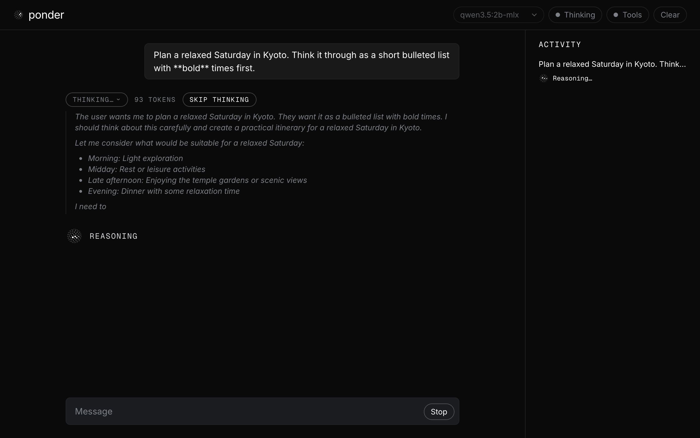

# ponder

A small local chat client for [Ollama](https://ollama.com) that shows what the model is doing, live, with [Thinking Orbs](https://thinkingorbs.com).



## Requirements

- Node 20.19+ or 22.12+
- Ollama running locally at `http://localhost:11434` (`ollama serve`, or the Ollama app)
- At least one model pulled. The default is `qwen3.5:2b-mlx`:
  `ollama pull qwen3.5:2b-mlx`. If it isn't installed, ponder picks the first
  model you have.

## Install and run

```bash
git clone https://github.com/swayyaam/ponder.git && cd ponder
npm install
npm run dev
```

Open http://localhost:5173. To use an Ollama on another machine, start it with
`OLLAMA_URL=http://192.168.1.20:11434 npm run dev`.

The browser never talks to Ollama directly. Vite proxies `/ollama/*` to it, so
there are no CORS issues.

## Features

- Streams replies from `/api/chat`. Answers and the model's thinking render as
  markdown and are revealed smoothly, a few characters per frame
- Model picker filled from `/api/tags`. The Thinking and Tools toggles follow
  each model's reported `capabilities`
- Collapsible thinking block with a live token count. It opens while the model
  thinks, stays open while the answer streams below it, and folds when you send
  the next message
- Stop button, which aborts the request, and Clear, which resets the chat
- Copy and Retry under each reply. Copy takes the raw markdown, Retry asks the
  same prompt again
- Edit any prompt you sent. Sending the edit replaces that prompt and
  everything after it, in the thread and in the history the model sees
- While a reply streams, the thread follows it only if you're at the bottom, so
  you can scroll up and read
- **Activity** panel that logs each turn: model load time, prompt tokens, how
  long it thought, tool calls, tokens/sec, and loop guard retries, all taken
  from the stream's own fields. Each kind of line has its own icon, and the
  line for what's happening now shows the live orb
- Two tools with a full call loop (the model asks, ponder runs the tool, the
  result goes back, the model continues):
  - `get_time`: the local time, computed in the browser
  - `read_file`: reads a file from `./sandbox`
- A loop guard that stops runaway thinking and retries without it (see below)

### Orb states

Every orb change comes from a real event in the stream. Nothing runs on a timer.

| What the stream is doing | How ponder detects it | Orb |
| --- | --- | --- |
| Request sent, no chunk yet (model loading or reading the prompt) | Request in flight, nothing received. Labelled "Loading <model>" when `/api/ps` showed the model wasn't in memory before sending | `working` |
| Thinking | Chunk has a non-empty `message.thinking` | `reasoning` |
| Tool call in progress | Chunk has `message.tool_calls`. Lasts while the tool runs and until the model's first chunk after it gets the result | `searching` |
| Writing the answer | Chunk has a non-empty `message.content` | `base`, at 0.6× speed (the calmest orb) |
| Done, stopped, or failed | Stream ended, request aborted, or an error came back | `base`, paused and dimmed |

The orb in the header always shows the current state. While a request runs, a
larger orb and its label sit under the thread.

### Thinking and Tools toggles

- **Thinking** sends `think: true`, so models that can reason do it before
  answering. It's disabled for models without the `thinking` capability.
  Thinking text is shown but never sent back to the model as history.
- **Tools** sends `get_time` and `read_file` with each request. It only appears
  for models with the `tools` capability.

ponder doesn't send sampling options (temperature, top_p and so on), so every
model runs with the settings its own Modelfile recommends.

### Loop guard

Small reasoning models sometimes think forever. ponder watches the thinking as
it streams and stops it when either of these happens:

- **Looping**: the same block of text (a 40+ character run) repeats 3 times in
  a row. List items that share a phrase but differ elsewhere don't count.
- **Over budget**: thinking passes 3000 tokens or 90 seconds.

You can also press **Skip thinking** while the model is reasoning.

When it trips, ponder aborts the request, keeps the partial thinking open and
marks it "stopped: looping", "stopped: over budget" or "stopped: skipped", then
retries the same turn once with thinking off so you still get an answer. The
Activity panel logs the retry, for example "Thinking looped, retried without
thinking".

Every request also sends `num_predict: 8192`, so no single response can run
unbounded. The limits are constants in [`src/loopGuard.ts`](src/loopGuard.ts).

## Limits

- **Dev server only.** ponder runs through Vite: `npm run dev`, or
  `npm run preview` after `npm run build`. There's no standalone production
  server. A static `dist/` on its own has no Ollama proxy and no `read_file`.
- **`read_file` is restricted to `./sandbox`.** The endpoint
  ([`server/sandbox.ts`](server/sandbox.ts)) rejects `..`, absolute paths that
  escape and symlinks that point outside the folder, and caps reads at 64 KB.
  Put your own files in `./sandbox` to let the model read them.
- **Tested on macOS with MLX models** (`qwen3.5:2b-mlx`, `qwen3.5:0.8b-mlx`,
  `gemma4:e2b-mlx`) on Apple Silicon. Other platforms and GGUF models should
  work but haven't been tested.
- History lives in memory for the session. Reloading the page or pressing
  Clear starts over.

## Development

```bash
npm test          # unit tests (vitest)
npm run lint      # oxlint
npx tsc -b        # type-check
npm run build
```

The look follows [`DESIGN.md`](DESIGN.md), dark variant. Every color, type
size, spacing step, radius, icon size and orb size is a CSS variable in
[`src/styles/theme.css`](src/styles/theme.css). Icons come from
[lucide](https://lucide.dev) (`lucide-react`), drawn with a 1.5 stroke in the
current text color. The orbs are the only animated element.

## License

[MIT](LICENSE) © Swayam Mishra
